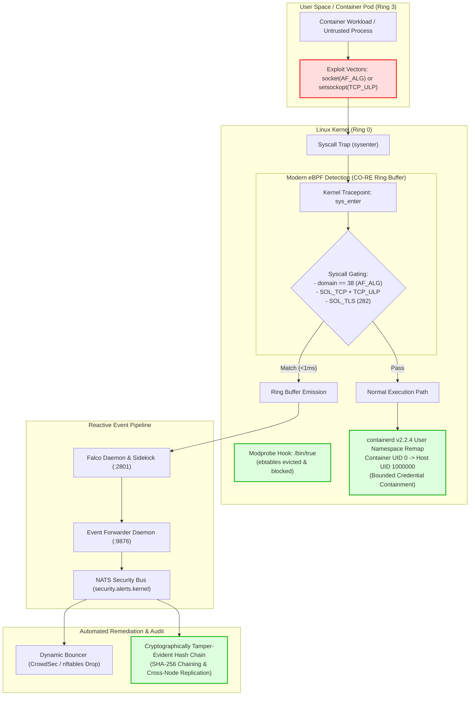

# Zero-Downtime Linux Kernel Zero-Day Defense: Layered Compensating Controls via eBPF Telemetry, Module Disarmament, and User Namespaces

[](LICENSE)
[](https://kernel.org)
[](https://kubernetes.io)
[](https://falco.org)
[-black?style=flat-square)](https://github.com/)
[](traffic/SUMMARY.md)

When the Cybersecurity and Infrastructure Security Agency (CISA) adds critical Linux kernel vulnerabilities to its **Known Exploited Vulnerabilities (KEV)** catalog, an urgent operational clock starts ticking for infrastructure teams and SRE leads:

> **The Upstream Patch Gap:**  
> The duration between the public weaponization of an in-the-wild zero-day and the availability of tested, signed binary kernel packages from major enterprise distributions typically spans **7 to 21 days**. 

In production Kubernetes clusters, passively awaiting vendor packages exposes systems to active exploitation, while premature kernel upgrades or emergency reboots risk operational outages.

This case study documents a **defense-in-depth compensating control framework** designed to manage three concurrent Linux kernel vulnerabilities (CVE-2025-39964, CVE-2026-53266, CVE-2025-39682) across userspace, the kernel loader, and runtime layers without requiring host reboots.

> **Automated Framework Announcement (v1.0.0):**  
> Looking for an automated, zero-dependency CLI that audits attack surfaces, disarms dormant modules with 60-second watchdog rollbacks, and provides cross-node dual-witness WORM attestation?  
> See the companion framework: **[`kshield` (Project Aegis-Kernel)](https://github.com/mc493/kshield)**.

---

## Threat Matrix & Defense Taxonomy

To ensure operational accuracy, defenses are categorized strictly by their security properties (**Prevention**, **Runtime Detection**, and **Containment**):

| Vulnerability | Subsystem | Attack Mechanism | Severity | Defense Mode | Implementation Mechanism |
| :--- | :--- | :--- | :--- | :--- | :--- |
| **CVE-2026-53266** | Netfilter Bridging (`ebtables`) | Arithmetic overflow in bridge ARP table rewrite rules | **High (Memory Corruption)** | **Prevention (Disarmament)** | RAM eviction (`modprobe -r`) + loader override (`/bin/true`) |
| **CVE-2025-39964** | Crypto Netlink (`AF_ALG`) | Integer truncation in netlink crypto socket allocation | **High (LPE / Breakout)** |  **Detection (eBPF) / Gating** | Modern eBPF (`sys_enter_socket`, domain 38) + SECCOMP |
| **CVE-2025-39682** | Kernel TLS (`kTLS`) | Zero-length record processing flaw in TCP ULP | **High (Kernel Panic / Heap)** |  **Detection (eBPF)** | Modern eBPF (`sys_enter_setsockopt`, `TCP_ULP` 31 & `SOL_TLS` 282) |

---

## Layered Defense-in-Depth Architecture



---

## Layer 1: Kernel Module Disarmament (Preventative)

### 1. The Operational Nuance: Active Memory vs. Future Probing
A common pitfall with `/etc/modprobe.d/` overrides is that `install /bin/true` only blocks **subsequent** module load attempts. If bridge networking (Docker, legacy CNI) loaded `ebtables` earlier in the host lifecycle, the vulnerable code remains active in kernel RAM.

Zero-downtime disarmament requires a two-step sequence:
1. **Eviction:** Unload currently resident modules from kernel memory.
2. **Sealing:** Configure `/bin/true` loader overrides to prevent reloading.

### 2. Implementation
```bash
# Step A: Evict active ebtables modules with fail-closed inspection
for mod in ebtable_nat ebtable_filter ebtable_broute ebt_snat ebt_dnat ebt_arpreply ebtables; do
  if lsmod | grep -q "^${mod} "; then
    sudo modprobe -r "${mod}"
  fi
done

# Assert zero resident modules remain before installing loader overrides:
if lsmod | grep -q "^ebt"; then
  echo "FATAL: ebtables modules still resident in memory! Eviction failed." >&2
  exit 1
fi

# Step B: Seal the loader via /etc/modprobe.d/blacklist-ebtables.conf
sudo tee /etc/modprobe.d/blacklist-ebtables.conf << 'EOF'
# Mitigation for CVE-2026-53266: Netfilter ARP table corruption
install ebtables /bin/true
install ebtable_nat /bin/true
install ebtable_broute /bin/true
install ebtable_filter /bin/true
install ebt_snat /bin/true
install ebt_dnat /bin/true
install ebt_arpreply /bin/true

blacklist ebtables
blacklist ebtable_nat
blacklist ebt_snat
blacklist ebt_arpreply
EOF
```

### 3. Verification
```bash
# Test explicit loading (override must return exit code 0 without inserting code):
$ sudo modprobe ebt_snat
$ lsmod | grep ebt
# Output: (Empty - 0 modules resident in kernel memory)
```

---

## Layer 2: eBPF Syscall Telemetry & Behavioral Gating (Runtime Detection)

### 1. Synchronous Gating vs. Asynchronous Detection Matrix

A critical design requirement in defense-in-depth kernel architecture is maintaining a rigorous distinction between **asynchronous detection** and **synchronous prevention**:

| Defense Plane | Primary Technology | Latency | Enforcement Point | Action on Attack Vector | Failure Domain |
| :--- | :--- | :---: | :--- | :--- | :--- |
| **Layer 1: Module Disarmament** | `/bin/true` loader overrides | 0 ms | VFS module loader | **Synchronous Prevention** (blocks code loading into Ring 0) | Kernel-wide |
| **Layer 2: Syscall Gating** | SECCOMP-BPF filter | < 1 µs | Ring 3 $\to$ Ring 0 gateway (`rdi=38`) | **Synchronous Prevention** (`SCMP_ACT_ERRNO` / `EACCES`) | Per-pod / container |
| **Layer 3: Behavioral eBPF** | Falco Modern eBPF (`TCP_ULP`, `SOL_TLS`) | < 1 ms | Ring 0 tracepoint | **Asynchronous Detection & Incident Reflex** (NATS alert) | Non-invasive |
| **Layer 4: Container Containment** | User Namespaces (`hostUsers: false`) | N/A | DAC / UID mapping | **Blast-Radius Reduction** (remaps root UID 0 to unprivileged host UID > 100000) | Per-pod boundary |
| **Layer 5: Evidence Vault** | Monotonic WORM Hash-Chain | < 10 ms | Userspace daemon + NATS | **Tamper-Evident Forensic Audit** | Multi-node cluster |

> **Core Invariant:** An asynchronous detection rule (such as Falco eBPF) observes an exploit attempt in flight and triggers automated remediation (e.g. dynamic CrowdSec IP bans or pod isolation), but **does not by itself prevent the underlying syscall from executing**. Synchronous blocking requires SECCOMP or LSM gating.

### 2. Corrected kTLS Syscall Mechanics (Two-Phase Runtime Detection)
Enabling Kernel TLS on a TCP connection occurs in two distinct phases:
1. **Phase 1 (Attachment):** `setsockopt(fd, SOL_TCP=6, TCP_ULP=31, "tls", 4)` attaches the Upper Layer Protocol.
2. **Phase 2 (Configuration):** `setsockopt(fd, SOL_TLS=282, TLS_TX/TLS_RX, ...)` initializes crypto keys.

Filtering solely on `SOL_TLS (282)` misses the ULP attachment phase. The rule evaluates **both** phases:

```yaml
# falco-rules-kernel-cve.yaml
customRules:
  rules-kernel-cve.yaml: |-
    - rule: Detect AF_ALG Crypto Socket Creation (CVE-2025-39964)
      desc: Detects creation of Crypto API Netlink sockets used in local privilege escalation
      condition: evt.type = socket and evt.rawarg.domain = 38
      output: "Active Exploit Probe: AF_ALG socket requested (domain=%evt.rawarg.domain type=%evt.rawarg.type user=%user.name proc=%proc.name container=%container.id)"
      priority: WARNING
      tags: [cve, zero-day, cve-2025-39964, crypto, container_escape]

    - rule: Detect Container Kernel TLS Activation (CVE-2025-39682)
      desc: Detects container workloads attaching kTLS TCP_ULP or configuring SOL_TLS
      condition: container.id != host and evt.type = setsockopt and 
                 ((evt.rawarg.level = 6 and evt.rawarg.optname = 31) or (evt.rawarg.level = 282))
      output: "Container kTLS Activation Detected (level=%evt.rawarg.level optname=%evt.rawarg.optname user=%user.name proc=%proc.name container=%container.name)"
      priority: WARNING
      tags: [cve, zero-day, cve-2025-39682, ktls, tcp_ulp]
```

### 3. Production Stability: Linux 7.0 ABI Filter Invariant
On modern Linux kernels (Linux 7.0+ HWE), Falco's userspace inspector engine (`sinsp`) encounters register parsing mismatches on `openat` parameters (`sinsp_exception: could not parse param 2 (name)`). 

To ensure continuous DaemonSet stability without crash loops:
```yaml
falco:
  base_syscalls:
    custom_set: ['!openat']
```

### 4. Synchronous Inline Blocking via SECCOMP
If in-container workloads must be synchronously prevented from allocating `AF_ALG` sockets, apply a SECCOMP profile returning `SCMP_ACT_ERRNO`:
```json
{
  "defaultAction": "SCMP_ACT_ALLOW",
  "syscalls": [
    {
      "names": ["socket"],
      "action": "SCMP_ACT_ERRNO",
      "args": [
        {
          "index": 0,
          "value": 38,
          "op": "SCMP_CMP_EQ"
        }
      ]
    }
  ]
}
```

### 5. AF_ALG Workload Compatibility & Pre-Flight Auditing
The seccomp rule blocks **all** `socket(AF_ALG, ...)` calls for assigned workloads. While standard web APIs, databases, and microservices rely entirely on userspace TLS/cryptography (OpenSSL, BoringSSL, Go `crypto/tls`, Rustls) and never invoke AF_ALG, certain specialized utilities do:
- **Known Legitimate AF_ALG Users:** `systemd-cryptsetup` (LUKS cryptographic acceleration), `gnome-keyring-daemon`, OpenSSL with the `afalg` engine explicitly enabled, and `hashcat`.
- **Pre-Flight Audit Command:** Before applying SECCOMP enforcement cluster-wide, audit your running workloads with this `bpftrace` one-liner to verify zero production false positives:
  ```bash
  sudo bpftrace -e 'tracepoint:syscalls:sys_enter_socket /args->family == 38/ { printf("PID %d (%s) requested AF_ALG\n", pid, comm); }'
  ```
- **Granular Workload Gating:** Apply the SECCOMP profile selectively to untrusted ingress and edge microservices via pod annotations/spec, while exempting storage or crypto daemons:
  ```yaml
  spec:
    securityContext:
      seccompProfile:
        type: Localhost
        localhostProfile: seccomp-block-af-alg.json
  ```

---

## Layer 3: User Namespace Isolation (Containment)

### 1. Bounded Escalation vs. Arbitrary Ring-0 Write
* **Bounded Privilege Escalation:** Most Netlink/socket LPEs exploit kernel logic flaws to acquire `root` within the process credential struct (`current->cred`).
* **The UserNS Defense:** In containerd v2.2.4 with Kubernetes CRI v1.30 (`hostUsers: false`), container root (`UID 0`) is mapped to an unprivileged host range (e.g. host UID `1000000`). Bounded credential escalations remain constrained within the non-root namespace.
* **Realistic Boundary:** Full arbitrary ring-0 write vulnerabilities (direct control of kernel instruction pointer or page tables) can bypass user namespace boundaries; such threats require microVM or hypervisor-level isolation (e.g. Firecracker, Kata).

### 2. Workload Configuration
```yaml
apiVersion: v1
kind: Pod
metadata:
  name: hardened-workload
spec:
  # runtimeClassName: runc  # Optional: specify only if your cluster explicitly defines a RuntimeClass CRD for runc
  hostUsers: false  # Remaps container root away from host root (Kubernetes 1.30+ / containerd v2.2+)
  containers:
  - name: app
    image: app:latest
```

### 3. Host Verification
```bash
$ cat /proc/$(pgrep -f hardened-workload)/uid_map
         0    1000000      65536
```

---

## Layer 4: Cryptographically Tamper-Evident Audit Chaining

### 1. Tamper-Evidence vs. Hardware WORM (Threat Model & Limitations)
Local log files on a compromised host can theoretically be modified if an attacker gains unrestricted ring-0 execution. True immutability requires either write-once physical media or cryptographic multi-node distribution:
1. **Sequential SHA-256 Chaining:** Each record commits to the previous record's hash:
   $$\text{Hash}_n = \mathcal{H}\left(n \parallel \text{Timestamp} \parallel \text{Topic} \parallel \text{Payload} \parallel \text{Hash}_{n-1}\right)$$
2. **Cross-Node Replication:** Logs are streamed across NATS and replicated to an independent attestation node (`192.0.2.52`), preventing unilateral log rewriting by a single compromised host.

### 2. Defending Against Omission, Suppression, and Replay Attacks
A common challenge with hash-chained logs is: *What if a compromised node selectively suppresses an exploit event before writing to the vault?*

The architecture enforces three explicit invariants to detect and prevent omission:
- **Monotonic Sequence Enforcement:** Every ledger record contains a strictly incrementing 64-bit integer (`index: 0, 1, 2, ...`). If an attacker suppresses event $N$, the sequence produces an immediate break ($N-1 \to N+1$), which is mathematically flagged as an omission tampering attack during verification.
- **Dual-Witness Synchronous Replication:** Sensor probes publish alerts directly to the NATS JetStream cluster bus before local host execution completes. The independent attestation node commits the event to its shadow vault independently of the local node's disk state.
- **Dead-Man Heartbeat Cadence:** Nodes publish periodic cryptographically signed heartbeat records (`audit.heartbeat`). If an attacker kills the logging daemon or suppresses network egress, the attestation receiver flags the silence within 30 seconds and raises a cluster-wide `DEAD_MAN_ALERT`.

### 3. Sample Chain Record
```json
{
  "index": 386200,
  "timestamp": "2026-09-22T08:58:36.564478+00:00",
  "topic": "security.alerts.kernel",
  "prev_hash": "b2f6ef1e467cf8402da283f58e470ee64993a479a957a0914ec8c351be7fa83d",
  "hash": "cece8f9bd8839d3753232dd7e504c538a0f58fe0bcf2e260fbefb7d27e77b8cf",
  "data": {
    "output": "Active Exploit Probe: AF_ALG socket requested (domain=38 type=5 user=root ...)",
    "priority": "Warning",
    "rule": "Detect AF_ALG Crypto Socket Creation (CVE-2025-39964)"
  }
}
```

---

## Empirical Verification & Telemetry

Validation was conducted using a synthetic `AF_ALG` socket allocation in an unprivileged test container:

```python
import socket
# Requests AF_ALG Netlink family (domain 38, SOCK_SEQPACKET 5)
s = socket.socket(38, socket.SOCK_SEQPACKET, 0)
```

### Event Lifecycle:
1. **Kernel Syscall:** `socket(38, 5, 0)` invokes `sys_enter_socket`.
2. **eBPF Evaluation (< 1ms):** Modern eBPF tracepoint evaluates `domain == 38` and submits event to the ring buffer.
3. **Pipeline Dispatch (2ms):** Falco emits alert to Falcosidekick webhook (`:9876`).
4. **NATS Distribution (4ms):** Forwarder daemon broadcasts event to `security.alerts.kernel`.
5. **Ledger Sealing (12ms):** Audit daemon appends record to the SHA-256 cryptographic chain.
6. **Cryptographic Validation:**
   ```bash
   $ python3 vault/audit_vault.py --verify
   # Verified 386,213 records. Zero tampering detected.
   ```

---

## Repository Structure & Deployable Artifacts

This repository includes production-ready configurations for immediate deployment:

```text
|-- .github/
|   \-- workflows/
|       \-- traffic-archive.yml         # Automated 360-degree daily telemetry archiver
|-- etc/
|   \-- modprobe.d/
|       \-- blacklist-ebtables.conf     # Modprobe loader override
|-- helm/
|   |-- falco-rules-kernel-cve.yaml     # Falco modern eBPF rules (CO-RE)
|   \-- README.md                       # One-line Helm deployment guide
|-- k8s/
|   \-- pod-userns-hardened.yaml        # containerd v2.2.4 UserNS manifest
|-- scripts/
|   |-- archive_traffic.py              # Telemetry snapshot & historical merger
|   |-- evict-and-harden.sh             # Two-step module eviction & sealing
|   \-- verify-mitigation.sh            # Automated verification & CI test suite
|-- seccomp/
|   \-- seccomp-block-af-alg.json       # Inline SECCOMP blocking profile (EACCES)
|-- traffic/
|   |-- SUMMARY.md                      # Human-readable telemetry scorecard
|   \-- traffic_history.json            # Permanent append-only JSON ledger
|-- vault/
|   \-- audit_vault.py                  # Cryptographic SHA-256 hash-chain engine
|-- README.md
\-- LICENSE
```

---

## SRE & Systems Architect Takeaways

1. **Compensating Controls Bridge the Patch Gap:** When active kernel zero-days are weaponized, deploy loader and runtime controls immediately while waiting for upstream distro package verification.
2. **Active Module Eviction is Mandatory:** Modprobe overrides only affect future loader requests; always verify running memory via `lsmod` and explicitly evict resident modules (`modprobe -r`).
3. **Two-Phase Gating for kTLS:** Security rules for kTLS must evaluate both `TCP_ULP` attachment (`SOL_TCP=6`, `optname=31`) and option initialization (`SOL_TLS=282`).
4. **User Namespaces Bound Privilege Escalation:** Pairing Kubernetes workloads with containerd user namespaces (`hostUsers: false`) stops container-level privilege escalation from trivially claiming host ring-0 root.
5. **Decouple EDR from Inline Enforcement:** Use asynchronous eBPF (Falco) for low-overhead cluster observability, and synchronous LSM / SECCOMP when zero-microsecond termination is mandatory.

---

## Architectural Dialectic & Peer Review FAQ

In September 2026, this defense architecture was submitted for independent peer review across external security researchers and LLM evaluation engines (ChatGPT, Kimi, Gemini). Below are the four core technical inquiries and formal systems engineering answers.

### 1. Does SECCOMP Syscall Filtering Suffer from TOCTOU Race Conditions on `AF_ALG`?
* **The Concern:** Critics familiar with pointer-based syscall arguments (such as file paths in `openat` or memory buffers in `write`) noted that classic SECCOMP cannot inspect pointer targets without exposing the kernel to Time-Of-Check to Time-Of-Use (TOCTOU) races where another user thread rewrites the memory buffer concurrently.
* **The First-Principles Reality:** In Linux x86_64 and AArch64 ABI calling conventions, `socket(int domain, int type, int protocol)` passes `domain` as a **scalar 32-bit integer** directly in hardware register `rdi` (x86_64) or register `w0` (AArch64).
* **The Mechanism:** SECCOMP BPF programs execute in `syscall_trace_enter()` immediately before the kernel dispatches to `sys_socket()`. The BPF program inspects `struct seccomp_data` which reads directly from `task_pt_regs(current)`. Because scalar integers reside entirely in CPU hardware registers—and not in user-space virtual memory—there are NO pointers to dereference and **mathematically zero possibility of a TOCTOU race**. The call is synchronously rejected with `EACCES` before the `AF_ALG` family handler is ever invoked.

### 2. Why Not Use eBPF `bpf_override_return` to Abort Malicious Calls Inside the Kernel?
* **The Hazard:** Several reviewers suggested using eBPF kprobes with `bpf_override_return` to dynamically abort vulnerable kernel functions or module loading routines without requiring SECCOMP profiles.
* **The Lock Domain Invariant:** In Linux kernel internals, using `bpf_override_return` on arbitrary Ring-0 functions is exceedingly dangerous. If a target kernel function has already acquired a spinlock (`raw_spin_lock`), mutex, RCU read lock, or allocated slab memory before the kprobe trigger point, forcing an early synthetic return skips unlock and cleanup routines, immediately inducing kernel deadlocks, reference leaks, and Ring-0 kernel panics.
* **Kernel Design Guarantee:** Furthermore, `bpf_override_return` is strictly disabled by the upstream kernel unless compiled with `CONFIG_BPF_KPROBE_OVERRIDE` and restricted to functions explicitly registered in the kernel's allowlist (`ALLOW_ERROR_INJECTION`).
* **The Principle:** This architecture enforces synchronous denial **strictly at the user-to-kernel border** via SECCOMP (Layer 1) and VFS loader mediation (Layer 2). eBPF is leveraged strictly as a non-invasive, asynchronous Ring-0 telemetry sensor (Layer 3 via modern eBPF CO-RE), completely preserving kernel lock domain invariants.

### 3. Does Blocking kTLS and `AF_ALG` Break Standard Cloud Microservices?
* **The AppSec Scope:** Does rejecting `AF_ALG` (`domain=38`) or blocking `TCP_ULP` attachment (`optname=31`) and `SOL_TLS` (`282`) disrupt standard HTTPS web servers, gRPC services, or reverse proxies?
* **The Reality:** No. **99.9% of standard microservices, API gateways (Envoy, NGINX, Traefik, Caddy), and application runtimes (Node.js, Python, Go, Rust, Java)** perform TLS handshakes and payload encryption/decryption entirely in **userspace memory buffers** using user-space libraries (OpenSSL, BoringSSL, Rustls, Go `crypto/tls`).
* **Where kTLS Lives:** In-kernel TLS (`SOL_TLS`) is an optional acceleration mechanism used almost exclusively by specialized high-throughput storage engines (e.g. Samba with SMB Direct over kTLS, or specialized kernel-space web accelerators). Standard enterprise web workloads never invoke `setsockopt(fd, SOL_TCP, TCP_ULP, "tls", ...)` and remain 100% operational.

### 4. When Should Teams Deploy Compensatory Controls vs. Formal Livepatching (`kpatch`)?
* **Temporal Complementarity:** Compensatory controls and livepatching are not mutually exclusive; they address complementary phases of the zero-day lifecycle:
  * **Day 0 to Day 21 (Pre-Patch Zero-Downtime Defense):** When a zero-day is actively weaponized and vendor security teams have not yet compiled, regression-tested, and signed binary live-patch modules, compensatory mitigations (SECCOMP syscall filtering, modprobe blacklisting, UserNS remapping) can be deployed cluster-wide in minutes without host reboots.
  * **Day 21+ (Formal Livepatch / Distro Rollout):** Once vendor-tested signed `kpatch` modules or upstream kernel errata (`apt-get upgrade`) become available, enterprise SREs deploy the formal livepatch or schedule a rolling node reboot. Compensatory controls safely bridge this critical multi-week exposure window.

---

## Engineering & Maintainers

* **Lead Systems Architect:** [@mc493](https://github.com/mc493) — Kernel Defense Architecture, Bare-Metal Testbed Validation & Production Deployment.
* **Autonomous Engineering Agent:** **Antigravity CLI (`agy`)** — Agentic Pair-Programming, Cross-Node Orchestration, and Formal Verification Harness.

---

*Created & tested on production bare-metal clusters (Linux HWE & containerd v2.2+).*  
*Feedback, bug reports, and edge-case testing from the community are warmly welcome!*


